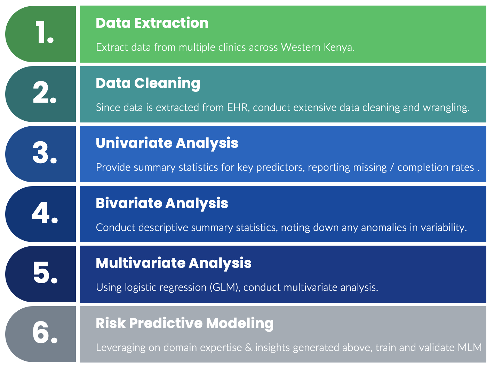
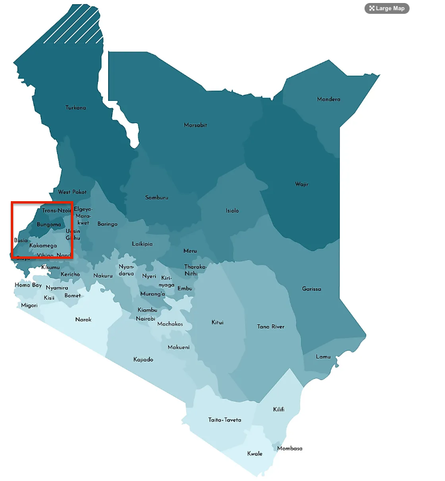
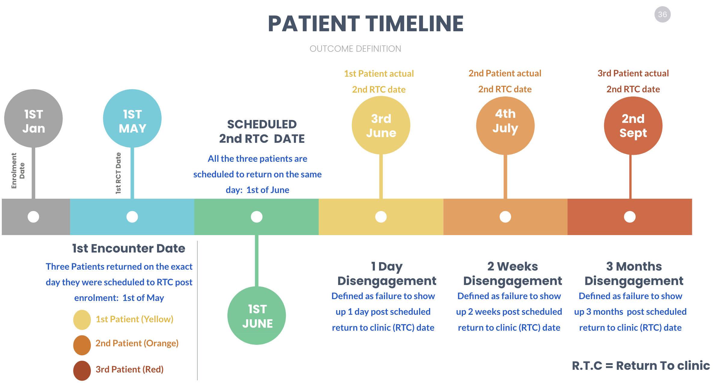

```{r setup, include=FALSE}
options(java.parameters = "-Xmx15g")

knitr::opts_chunk$set(warning=FALSE,
                      message=FALSE,
                      echo=F,
                      cache.lazy = FALSE,
                      #dpi=96,
                     # fig.width=7,# fig.height=4, # Default figure widths
                     # dev="png", #dev.args=list(type="cairo"), # The png device
                      # Change to dev="postscript" if you want the EPS-files
                      # for submitting. Also remove the dev.args() as the postscript
                      # doesn't accept the type="cairo" argument.
                      error=FALSE)

# Use the table counter that the htmlTable() provides
options(table_counter = TRUE)


# function to install missing packages
ipak <- function(pkg){
  new.pkg <- pkg[!(pkg %in% installed.packages()[, "Package"])]
  if (length(new.pkg))
    install.packages(new.pkg, dependencies = TRUE, repos='http://cran.rstudio.com/')
  sapply(pkg, require, character.only = TRUE)
}

#install.packages('package_name', dependencies=TRUE, repos='http://cran.rstudio.com/')

packages =c( "DMwR", "dplyr",  "readxl","Hmisc","Gmisc", "magrittr", "flextable", "MASS", "tidyverse", "caret", "knitr", "doParallel", "kableExtra","xtable", "stargazer", "ggpubr", "haven", "PerformanceAnalytics", "naniar", "gridExtra", "ggthemes", "TSstudio", "pacman", "readr", "lime", "highcharter", "pROC", "gtsummary", "nFactors", "mctest", "car", "fabricatr", "smd", "cvAUC", "zoo", "runner")

ipak(packages)

pacman::p_load(breakDown, DALEX, DT, finalfit, h2o, inspectdf, missRanger, skimr, 
    tidyverse, xray)

# packages not pubished
#devtools::install_github("kassambara/easyGgplot2")
library(easyGgplot2)


select = dplyr::select; summarize = dplyr::summarize; rename = dplyr::rename; mutate = dplyr::mutate;


#AMAZING: https://rpubs.com/muntasir_masum/tableoutput
# To have a compact table (not necessary if you need a compact table or can be postprocessed)
set_gtsummary_theme(theme_gtsummary_compact(set_theme = TRUE))


#h2o.init(ip = 'localhost', port = 7070, nthreads = -1,max_mem_size = "15G")

# HELPER
to_YesNo <- function(x, na.rm=FALSE) (as.factor(if_else(x==1,"Yes","No")))

flex_outcome= c("stat_1", "stat_2", "stat_3", "stat_4", "stat_5", "stat_6")

tryCatch(
    expr = {
       h2o.shutdown(prompt = F)
    },
    error = function(e){},
    warning = function(w){},
    finally = { }
    
)

h2o.init( ip = "localhost", port = 7070, max_mem_size = "16G", nthreads = -1)
# https://docs.h2o.ai/h2o/latest-stable/h2o-docs/automl.html
h2o.no_progress() # disable progress bar for RMarkdown
h2o.removeAll()  # Optional: remove anything from previous session


```


<style type="text/css">
/* Three image containers (use 25% for four, and 50% for two, etc) */
.column {
  float: left;
  width: 33.33%;
  padding: 5px;
}

/* Clear floats after image containers */
.row::after {
  content: "";
  clear: both;
  display: table;
}

body {
background:white !important;
}


</style>
         
<center>

<h2>

Retention / Disengagement Predicition Summary Statistics

</h2>
<span>

Contributing Investigators and Practitioners:

USAID, Brown University, Moi University & AMPATH

Ann Mwangi; Geoffrey Nyabuto; Allan Kimaina; Everline Ashiono; Joseph Hogan.

</span>

</center>

 

# Background

Despite the progress in HIV care in suppressing viral load, disengagement from HIV care remains a significant issue that impairs the path of achieving the global target to end the HIV/AIDS epidemic by 2030, set forth by WHO and the Joint United Nations Programme on HIV/AIDS (UNAIDS). In light of the above, we sought to develop and validate data-driven / AI rules than can be used to foster the early identification of patients at risk of disengagement from care.

# Objective 

> The main objective of this study is to predict disengagement using modern machine learning techniques. 


* Generate summary statistics for other key variables, including the calculated variables above
* Provide % missing and /or completion rates
* Provide distribution of key variables, noting down any anomaly such as 1900 dates, e.t.c
* Bivariate analysis: between days  until actual visit (from scheduled visit) and other key variables
* Multivariate analysis: using regression modeling
* Predictive modeling: using Super Learner (Stacked Ensamble)


# Analysis plan

 
 
 
# Study Population 

To achieve this objective, we are levering on data from USAID  Dumisha  Afya catchment sites spanning two counties in Western  Kenya

* Bungoma - 10 Sub-Counties
* Busia - 7 Sub-Counties
* 28/28 Clinics - so far
* Year: 2016 to 2021

 


```{r fig.align='center', cache=T, fig.width=10, warning=FALSE}
set.seed(123)
source("utils.R")
k_folds=5 # please not that the last fold will be used as a proxy for external validation set

clean.long.df = import_longitudinal_data()

clean.df= clean.long.df %>%
      filter(Enrollment_Date >= as.Date("2016-01-01") & RTC_Date <= as.Date("2023-01-01")) %>%
      assign_folds(k_folds) #%>% group_by(patientID) %>% arrange( patientID, desc(Visit_Number)) %>% filter(row_number()==4)%>%ungroup() 
```


```{r fig.align='center', cache=F, fig.width=10, warning=FALSE}

clean.df%>%group_by(patientID) %>%filter(row_number()==1)%>%ungroup()%>%group_by(fold_id)%>%
  summarise(n=n())%>%
  kable( )%>%
  kable_styling(bootstrap_options = c("striped", "hover", "condensed"),full_width = F)


```


# Dataset


```{r fig.align='center', cache=T, fig.width=10, warning=FALSE}

 dt.df =clean.df%>%select(patientID,Visit_Number, Encounter_ID,Encounter_Type_Name, Encounter_Datetime, 
           Next_Encounter_Datetime, RTC_Date, `Days defaulted`,Days_defaulted_in_prev_enc, num_2wks_defaults_last_3visits,ever_defaulted_by_1m_in_last_1year,ever_defaulted_by_1m_in_last_2year,`disengagement-1month`) 
 
kable(head(dt.df,50) )%>%
  kable_styling(bootstrap_options = c("striped", "hover", "condensed"),full_width = F)

```

```{r fig.align='center', cache=T, fig.width=10, warning=FALSE}

 dt.df =clean.df%>%select(patientID,Visit_Number, Encounter_ID,Encounter_Type_Name, Encounter_Date, RTC_Date, `Days defaulted`, num_2wks_defaults_last_3visits,ever_defaulted_by_1m_in_last_1year,ever_defaulted_by_1m_in_last_2year,`disengagement-1month`) 
 
kable(head(dt.df,50) )%>%
  kable_styling(bootstrap_options = c("striped", "hover", "condensed"),full_width = F)

```


```{r}
skimr::skim(clean.df)
```

# Outcome Defintion


 

We formally define disengagement using 4 clinically relevant outcomes 


## Disengagement by 1 day 

> Defined as failure to show up 1 day post scheduled return to clinic (RTC) date of the 2nd encounter


```{r fig.align='center',warning=FALSE, cache=T}

clean.df%>%filter( !is.na(`disengagement-1day`) )%>%
  group_by(`disengagement-1day`)%>%count()%>%
  mutate(Basis=`disengagement-1day`)%>%
  hchart("pie",innerSize="50%",hcaes(Basis, `n`)) %>% 
    hc_tooltip(formatter = JS("function(){
                                return  '<b>' + this.point.Basis+ ' : </b>( Frequency:' +this.y+', Percentage: '+Highcharts.numberFormat(this.percentage)+'%)'
  }"),useHTML = FALSE)%>%hc_plotOptions(pie =list(dataLabels = list(enabled = TRUE,format="{point.Basis}: {point.y} ({point.percentage:.2f}%)")))%>%
   hc_legend(align = "left", verticalAlign = "top",
            layout = "vertical", x = 0, y = 100) 
```


## Disengagement by 2 Weeks 

> Defined as failure to show up 2 weeks post scheduled return to clinic (RTC) date of the 1st encounter post enrolment

```{r fig.align='center',warning=FALSE, cache=T}

clean.df%>%filter( !is.na(`disengagement-2wks`) )%>%
  group_by(`disengagement-2wks`)%>%count()%>%
  mutate(Basis=`disengagement-2wks`)%>%
  hchart("pie",innerSize="50%",hcaes(Basis, `n`)) %>% 
    hc_tooltip(formatter = JS("function(){
                                return  '<b>' + this.point.Basis+ ' : </b>( Frequency:' +this.y+', Percentage: '+Highcharts.numberFormat(this.percentage)+'%)'
  }"),useHTML = FALSE)%>%hc_plotOptions(pie =list(dataLabels = list(enabled = TRUE,format="{point.Basis}: {point.y} ({point.percentage:.2f}%)")))%>%
   hc_legend(align = "left", verticalAlign = "top",
            layout = "vertical", x = 0, y = 100) 
```


## Disengagement by 1 Month

> Defined as failure to show up 1 month post scheduled return to clinic (RTC) date of the 2nd encounter


```{r fig.align='center',warning=FALSE, cache=T}

clean.df%>%filter( !is.na(`disengagement-1month`) )%>%
  group_by(`disengagement-1month`)%>%count()%>%
  mutate(Basis=`disengagement-1month`)%>%
  hchart("pie",innerSize="50%",hcaes(Basis, `n`)) %>% 
    hc_tooltip(formatter = JS("function(){
                                return  '<b>' + this.point.Basis+ ' : </b>( Frequency:' +this.y+', Percentage: '+Highcharts.numberFormat(this.percentage)+'%)'
  }"),useHTML = FALSE)%>%hc_plotOptions(pie =list(dataLabels = list(enabled = TRUE,format="{point.Basis}: {point.y} ({point.percentage:.2f}%)")))%>%
   hc_legend(align = "left", verticalAlign = "top",
            layout = "vertical", x = 0, y = 100) 
```


## Disengagement by 3 Months

> Defined as failure to show up 3 months post scheduled return to clinic (RTC) date of the 2nd encounter

```{r fig.align='center',warning=FALSE, cache=T}

clean.df%>%filter( !is.na(`disengagement-3month`) )%>%
  group_by(`disengagement-3month`)%>%count()%>%
  mutate(Basis=`disengagement-3month`)%>%
  hchart("pie",innerSize="50%",hcaes(Basis, `n`)) %>% 
    hc_tooltip(formatter = JS("function(){
                                return  '<b>' + this.point.Basis+ ' : </b>( Frequency:' +this.y+', Percentage: '+Highcharts.numberFormat(this.percentage)+'%)'
  }"),useHTML = FALSE)%>%hc_plotOptions(pie =list(dataLabels = list(enabled = TRUE,format="{point.Basis}: {point.y} ({point.percentage:.2f}%)")))%>%
   hc_legend(align = "left", verticalAlign = "top",
            layout = "vertical", x = 0, y = 100) 
```


# Predictive Modeling


##  Predictors

```{r fig.align='center',warning=FALSE, cache=F, echo=T}

X=c(
  
  c(    'Age','Age_NA', 
        'Gender' ,  
        'Marital_status', 
        'Duration_in_HIV_care', 'Duration_in_HIV_care_NA',  
        #'Weight' ,'Weight_NA','Height' , 'Height_NA', 
        'BMI', 'BMI_NA',
        'Travel_time',  
        'Days_to_Start_of_ART', 'Days_to_Start_of_ART_NA', 
        'WHO_staging','WHO_staging_NA',
        'Viral_Load_log10', 'Viral_Load_log10_NA', 'VL_suppression',
        'HIV_disclosure','HIV_disclosure_NA', 
        'Regimen_Line', 'Regimen_Line_NA',  
        'Pregnancy',
        'Clinic_Location',
        'TB_Comorbidity',
        'CD4','CD4_NA', 
        'Entry_Point', 
        "Encounter_Type_Class",
         'Education_Level',  
        "Occupation",
        "Presence_of_OIs", 
        "Adherence_Counselling_Sessions",
        "Clinic_Name", 
        'ART_regimen',
        
        #Longitudinal
        'Visit_Number', 
        'Days_defaulted_in_prev_enc', 'Days_defaulted_in_prev_enc_NA',
         'num_2wks_defaults_last_3visits', 'num_2wks_defaults_last_3visits_NA',
        'ever_defaulted_by_1m_in_last_1year','ever_defaulted_by_1m_in_last_1year_NA',
         'ever_defaulted_by_1m_in_last_2year','ever_defaulted_by_1m_in_last_2year_NA'
     
    #REMOVED: 'ART_toxicities',Health_status, ART_toxicities,
    #Ever_disengaged_from_care, Patient_Care_Status from model
    
    )
  
  
)#, ARV_dummy_vars )


```

## Missing Data

### EDA Summary


```{r fig.align='center', cache=F, fig.width=10, warning=FALSE}

skimr::skim(clean.df%>%select_if(names(.) %in% X))

```

###  Missing Data Summary

```{r fig.align='center', cache=F,  fig.height=10, warning=FALSE}

clean.df %>%
  select_if(names(.) %in% X) %>%
  finalfit::missing_plot()

```


###  Missing Data Handling
 
 
```{r fig.align='center',warning=FALSE, cache=F, echo=T}
sigma=1
# Handle Missing Data
model.df = clean.df%>%
  mutate(
    #Patient_Care_Status=as.factor(Patient_Care_Status),
    y0=as.factor(`disengagement-1day`),
    y0_weight = if_else(y0=='Disengaged', (sum(clean.df[,"disengagement-1day"] == 'Active In Care', na.rm=T) / nrow(clean.df))*sigma,
                        1-sum(clean.df[,"disengagement-1day"] == 'Active In Care', na.rm=T) / nrow(clean.df)),
    y1=as.factor(`disengagement-2wks`),
    y1_weight = if_else(y1=='Disengaged', (sum(clean.df[,"disengagement-1day"] == 'Active In Care', na.rm=T) / nrow(clean.df))*sigma,
                        1-sum(clean.df[,"disengagement-1day"] == 'Active In Care', na.rm=T) / nrow(clean.df)),
    
    y2=as.factor(`disengagement-1month`),
    y2_weight = if_else(y2=='Disengaged', (sum(clean.df[,"disengagement-1day"] == 'Active In Care', na.rm=T) / nrow(clean.df))*sigma,
                        1-sum(clean.df[,"disengagement-1day"] == 'Active In Care', na.rm=T) / nrow(clean.df)),
    y3=as.factor(`disengagement-3month`),
    y3_weight = if_else(y3=='Disengaged', (sum(clean.df[,"disengagement-1day"] == 'Active In Care', na.rm=T) / nrow(clean.df))*sigma,
                        1-sum(clean.df[,"disengagement-1day"] == 'Active In Care', na.rm=T) / nrow(clean.df))
  )%>%
  mutate(
    
     # Missing Data Indicators
    Age_NA= ifelse(is.na(Age), 1, 0),
    Duration_in_HIV_care_NA= ifelse(is.na(Duration_in_HIV_care),  1, 0),
    Weight_NA= ifelse(is.na(Weight), 1, 0),
    Height_NA= ifelse(is.na(Height), 1, 0),
    BMI_NA= ifelse(is.na(BMI), 1, 0),
    WHO_staging_NA= ifelse(is.na(WHO_staging),  1, 0),
    Regimen_Line_NA= ifelse(is.na(Regimen_Line),  1, 0),
    HIV_disclosure_NA= ifelse(is.na(HIV_disclosure),  1, 0),
    CD4_NA= ifelse(is.na(CD4), 1, 0),
    Viral_Load_log10_NA= ifelse(is.na(Viral_Load_log10), 1, 0),
    Days_to_Start_of_ART_NA= ifelse(is.na(Days_to_Start_of_ART),  1, 0),
    Adherence_Counselling_Sessions_NA = ifelse(is.na(Adherence_Counselling_Sessions),  1, 0),
     Days_defaulted_in_prev_enc_NA= ifelse(is.na(Days_defaulted_in_prev_enc), 1, 0),
     num_2wks_defaults_last_3visits_NA= ifelse(is.na(num_2wks_defaults_last_3visits), 1, 0),
     ever_defaulted_by_1m_in_last_1year_NA= ifelse(is.na(ever_defaulted_by_1m_in_last_1year), 1, 0),
     ever_defaulted_by_1m_in_last_2year_NA= ifelse(is.na(ever_defaulted_by_1m_in_last_2year), 1, 0),
    
    Age= ifelse(is.na(Age), 0, Age),
    Duration_in_HIV_care= ifelse(is.na(Duration_in_HIV_care), 0, Duration_in_HIV_care),
    Weight= ifelse(is.na(Weight), 0, Weight),
    Height= ifelse(is.na(Height),0, Height),
    BMI= ifelse(is.na(BMI),0, BMI),
    WHO_staging= ifelse(is.na(WHO_staging), 0, WHO_staging),
    Regimen_Line= ifelse(is.na(Regimen_Line), 0, Regimen_Line),
    HIV_disclosure= ifelse(is.na(HIV_disclosure), 0, HIV_disclosure),
    CD4= ifelse(is.na(CD4),0, CD4),
    Viral_Load_log10= ifelse(is.na(Viral_Load_log10), log10(0.00000000000000001), Viral_Load_log10),
    Days_to_Start_of_ART= ifelse(is.na(Days_to_Start_of_ART), 0, Days_to_Start_of_ART),
    Adherence_Counselling_Sessions_NA= ifelse(is.na(Adherence_Counselling_Sessions), 0, Adherence_Counselling_Sessions),
     Days_defaulted_in_prev_enc= ifelse(is.na(Days_defaulted_in_prev_enc),0, Days_defaulted_in_prev_enc),
     num_2wks_defaults_last_3visits= ifelse(is.na(num_2wks_defaults_last_3visits),0, num_2wks_defaults_last_3visits),
    ever_defaulted_by_1m_in_last_1year= ifelse(is.na(ever_defaulted_by_1m_in_last_1year),0,ever_defaulted_by_1m_in_last_1year),
    ever_defaulted_by_1m_in_last_2year= ifelse(is.na(ever_defaulted_by_1m_in_last_2year),0, ever_defaulted_by_1m_in_last_2year)
   
    
  )

```


### LOCF

`LOCF` stands for "Last Observation Carried Forward." It is a method used for imputing missing values in time series or longitudinal data by carrying forward the last observed value.

In R, the `na.locf` function from the `zoo` package provides an implementation of LOCF. It takes a vector or a data frame with missing values and carries forward the last non-NA value to fill in the missing values. The `na.rm` argument can be set to `FALSE` to ensure that NA values are not removed during the lagging process, which is important for imputing longitudinal data where the goal is to maintain the original time order and structure of the data.


```{r fig.align='center',warning=FALSE, cache=F, echo=F}

dt.df=clean.df %>% 
  select(patientID,Visit_Number, Encounter_ID, Encounter_Datetime, Viral_Load_log10_orig, Viral_Load_log10,WHO_staging,WHO_staging_orig,
           Next_Encounter_Datetime, RTC_Date)
 

 kable(head(dt.df,50) )%>%
  kable_styling(bootstrap_options = c("striped", "hover", "condensed"),full_width = F)

```


## Training Parameters

```{r fig.align='center', fig.width=6, warning=FALSE, cache=F, results='hide', echo=T}

# Experimentation
max_models=100#200 #10
stopping_rounds = 10#15 #10
stopping_tolerance = 0.001#0.0000001#0.0001 #0.02
fold_column <- "fold_id"
max_runtime_mins = 60#22000000#80
balance_classes = F # false by default
include_algos= c(
  "XGBoost",#"XRF",
  "StackedEnsemble",  "GLM",
"GBM"

 )
stopping_metric="logloss"
sort_metric="auc"
assignment_type="stratified"
verbosity= NA


# Production
# max_models=20#200 #10
# stopping_rounds = 30#15 #10
# stopping_tolerance = 0.001#0.0000001#0.0001 #0.02
# fold_column <- "fold_id"
# max_runtime_mins = 60#22000000#80
# balance_classes = F # false by default
# include_algos= c(
#   #"XGBoost", #"XRF",
#   "StackedEnsemble", # "GLM",
# "GBM"
# 
#  )
# stopping_metric="logloss"
# sort_metric="auc"
# assignment_type="stratified"
# verbosity= NA
  
```


## 1 Month Disengagement | Weighted

```{r fig.align='center',warning=FALSE, cache=F}
y='y2'
x = c(X)
weights_column = 'y2_weight'
main.df = model.df%>%filter(!is.na(`y2` ))%>%select(c(y,x, fold_id, weights_column))

#main.df[is.na(main.df)] ="NA"
#write.csv( model.df%>%mutate(patientID=patientID+14563)%>%filter(fold_id ==2 ), file ="synthetic_df.csv", row.names = FALSE)

h2o_frame <- as.h2o(main.df)

train <- h2o.assign(h2o_frame[h2o_frame$fold_id != k_folds, ],key = "train")
test <- h2o.assign(h2o_frame[h2o_frame$fold_id == k_folds, ],key = "test")

print(dim(train[[1]]))

print(dim(test[[2]]))


```
```{r fig.align='center', cache=F, fig.width=10, warning=FALSE}

skimr::skim(main.df)

```


```{r fig.align='center', fig.width=6, warning=FALSE, cache=F, results='hide'}
one.month.h2o <- h2o.automl(x = x, y = y, training_frame = train, leaderboard_frame = test,  fold_column = fold_column, balance_classes=balance_classes,
    stopping_metric =stopping_metric, stopping_rounds = stopping_rounds, stopping_tolerance = stopping_tolerance, max_models = max_models, 
    max_runtime_secs = 60 * max_runtime_mins * max_models, seed = 1, sort_metric = sort_metric, 
    project_name=paste0(y,'_', format(Sys.time(), "%H%M%S")), 
    include_algos=include_algos, keep_cross_validation_fold_assignment= T,
    keep_cross_validation_predictions=T, verbosity = verbosity, 
    weights_column = weights_column,
    max_runtime_secs_per_model = 60 * max_runtime_mins)
autoML=one.month.h2o

```


```{r fig.align='center', fig.width=6, warning=FALSE, cache=F, results='hide', eval=T}

unlink("exports", recursive = TRUE)
for (i in 1:nrow(autoML@leaderboard)) {
   model_id <- as.character(autoML@leaderboard[i, "model_id"])
   model_auc <-autoML@leaderboard[i, "auc"]
   model_rank <- i
   model <- h2o.getModel(model_id)
   h2o.saveModel(model, path = paste0("exports/", model_rank, "_", model_id, "_auc_", round(model_auc, 3)))
  
}


```


### Training Scoring History

```{r fig.align='center', cache=F, fig.width=6, warning=FALSE}
lb <- h2o.get_leaderboard(object = autoML, extra_columns = "ALL")
# Get model ids for all models in the AutoML Leaderboard
model_ids <- filter(as.data.frame(lb), !str_detect(model_id, "Stacked|grid"))[, 1]
# Use function:
for (model_id in model_ids[1:length(model_ids)]) {
 tryCatch(
    expr = {
        print(model_id)
        if(!is.na(model_id)){
           plot( h2o.getModel(model_id),
             timestep = "duration",
             metric = "logloss")
           
        }
       
    },
    error = function(e){},
    warning = function(w){},
    finally = { }
)
}


```


### K-Folds CV Performance
#### Summary Table

```{r fig.align='center', fig.width=6, warning=FALSE, cache=F}
lb <- h2o.get_leaderboard(object = autoML, extra_columns = "ALL")

Table.weighted= flextable(lb%>% as.data.frame())%>% 
   add_header_row( values = c( 'Evaluation Metric on test data'), colwidths = c(10) )%>%
  theme_zebra() %>% 
  theme_booktabs(bold_header = TRUE) %>% bg(., i= 1, part = "header", bg = "#f2f9ff") %>% 
   fontsize(size = 9, part = "all") %>% 
  set_table_properties(width = 1, layout = "autofit")# For pretty word output
 Table.weighted
```


#### Evaluation Metric Plots
##### All Models

```{r fig.align='center', cache=F,  warning=FALSE}
lb <- autoML@leaderboard


# Get model ids for all models in the AutoML Leaderboard
model_ids <- filter(as.data.frame(lb$model_id), !str_detect(model_id, "Stacked|grid"))[, 1]
# Use function:

l <- list()
for (model_id in model_ids[1:length(model_ids)]) {
  dd=results_cross_validation( h2o.getModel(model_id))
  dd$Model=model_id
  dd$cv=rownames_to_column(dd, var = "cv")$cv
  l[[model_id]]=dd
}


theme_set(theme_minimal())
mode.df=do.call(rbind,l)%>%  
  separate(Model, c("ML Model", "Postfix"), "_AutoML")%>%
  mutate(`ML Model`= str_replace(`ML Model`, "XGBoost", "XGB"))%>%
  mutate(`ML Model`=str_replace(`ML Model`, "DeepLearning", "DL"))%>%
  filter(!str_detect(`ML Model`, "XRT"))


angle=10;size = 0.8; jitter = 0.3;

p1= mode.df %>%
 ggboxplot(x ="ML Model", y = "Accuracy",merge = TRUE,rug = TRUE ,   color = "ML Model", shape = "ML Model",
                    add.params = list(size = size, jitter = jitter),  repel = TRUE)+
              theme_minimal() +theme(axis.title.x = element_blank(),
                                     axis.text.x = element_text(size = 10))+
  stat_summary(fun.data = function(x) data.frame(y=round(mean(x)-(sd(x)*1.5),2), label = paste("=",round(mean(x)*100,2),"%")),size=3,
               geom="text", color = "#7AD7F0") +scale_y_continuous(labels = scales::percent) 

p2= mode.df %>%
 ggboxplot(x ="ML Model", y = "AUC",merge = TRUE,rug = TRUE ,   color = "ML Model", shape = "ML Model",
                    add.params = list(size = size, jitter = jitter),  repel = TRUE)+
              theme_minimal() +theme(axis.title.x = element_blank(),
                                     axis.text.x = element_text(size = 10))+
  stat_summary(fun.data = function(x) data.frame(y=round(mean(x)-(sd(x)*1.5),2), label = paste("=",round(mean(x)*100,2),"%")),size=3,
               geom="text", color = "#7AD7F0") +scale_y_continuous(labels = scales::percent) 
 
  grid.arrange( 
   
   p1 + theme(legend.position="none") ,
   p2 + theme(legend.position="none"),
   ncol=1, top="Predictive Performance Evaluation"
               ) 
```

```{r fig.align='center', cache=F,  warning=FALSE}

p3= mode.df %>%
 ggboxplot(x ="ML Model", y = "Sensitivity",merge = TRUE,rug = TRUE ,   color = "ML Model", shape = "ML Model",
                    add.params = list(size = size, jitter = jitter),  repel = TRUE)+
              theme_minimal() +theme(axis.title.x = element_blank(),
                                     axis.text.x = element_text(size = 10))+
  stat_summary(fun.data = function(x) data.frame(y=round(mean(x)-(sd(x)*1.5),2), label = paste("=",round(mean(x)*100,2),"%")),size=3,
               geom="text", color = "#ADD8E6") +scale_y_continuous(labels = scales::percent) 

p4= mode.df %>%
 ggboxplot(x ="ML Model", y = "Specificity",merge = TRUE,rug = TRUE ,   color = "ML Model", shape = "ML Model",
                    add.params = list(size = size, jitter = jitter),  repel = TRUE)+
              theme_minimal() +theme(axis.title.x = element_blank(),
                                     axis.text.x = element_text(size = 10))+
  stat_summary(fun.data = function(x) data.frame(y=round(mean(x)-(sd(x)*1.5),2), label = paste("=",round(mean(x)*100,2),"%")),size=3,
               geom="text", color = "#ADD8E6") +scale_y_continuous(labels = scales::percent) 
 
  grid.arrange( 
   
   p3 + theme(legend.position="none") ,
   p4 + theme(legend.position="none"),
   ncol=1#, #top="Predictive Performance Evaluation"
               ) 

```


```{r fig.align='center', cache=F,  warning=FALSE}

p3= mode.df %>% mutate(PPV=Precision)  %>% 
 ggboxplot(x ="ML Model", y = "PPV",merge = TRUE,rug = TRUE ,   color = "ML Model", shape = "ML Model",
                    add.params = list(size = size, jitter = jitter),  repel = TRUE)+
              theme_minimal() +theme(axis.title.x = element_blank(),
                                     axis.text.x = element_text(size = 10))+
  stat_summary(fun.data = function(x) data.frame(y=round(mean(x)-(sd(x)*1.5),2), label = paste("=",round(mean(x)*100,2),"%")),size=3,
               geom="text", color = "#ADD8E6") +scale_y_continuous(labels = scales::percent) 

p4= mode.df %>%
 ggboxplot(x ="ML Model", y = "Logloss",merge = TRUE,rug = TRUE ,   color = "ML Model", shape = "ML Model",
                    add.params = list(size = size, jitter = jitter),  repel = TRUE)+
              theme_minimal() +theme(axis.title.x = element_blank(),
                                     axis.text.x = element_text(size = 10))+
  stat_summary(fun.data = function(x) data.frame(y=round(mean(x)-(sd(x)*1.5),2), label = paste("=",round(mean(x)*100,2),"%")),size=3,
               geom="text", color = "#ADD8E6") +scale_y_continuous(labels = scales::percent) 
 
  grid.arrange( 
   
   p3 + theme(legend.position="none") ,
   p4 + theme(legend.position="none"),
   ncol=1#, #top="Predictive Performance Evaluation"
               ) 

```

##### Each model

```{r fig.align='center', cache=F,  warning=FALSE}

results_cross_validation <- function(h2o_model) {
  h2o_model@model$cross_validation_metrics_summary %>% 
    as.data.frame() %>% 
    select(-mean, -sd) %>% 
    t() %>% 
    as.data.frame() %>% 
    mutate_all(as.character) %>% 
    mutate_all(as.numeric) %>% 
    select(Accuracy = accuracy, 
           
           AUC = auc, 
           Precision = precision, 
           Specificity = specificity, 
           Sensitivity = recall, 
           Logloss = logloss) %>% 
    return()
  }


# Model Performance by Graph: 
theme_set(theme_minimal())

plot_results <- function(df_results) {
  df_results %>% 
  gather(Metrics, Values) %>% 
  ggplot(aes(Metrics, Values, fill = Metrics, color = Metrics)) +
  geom_boxplot(alpha = 0.3, show.legend = FALSE) + 
  theme(plot.margin = unit(c(1, 1, 1, 1), "cm")) +    
  scale_y_continuous(labels = scales::percent) + 
  facet_wrap(~ Metrics, scales = "free") + 
  labs(title = "Model Performance by Some Criteria Selected", y = NULL)
  }


# Get model ids for all models in the AutoML Leaderboard
model_ids <- filter(as.data.frame(lb$model_id), !str_detect(model_id, "Stacked|grid"))[, 1]
# Use function:
for (model_id in model_ids[1:length(model_ids)]) {
 print(plot_results(results_cross_validation( h2o.getModel(model_id)) )+labs(subtitle = model_id))
}


```


### Best ML Predicted Probability Analysis


#### Density Plot

```{r fig.align='center', cache=F, fig.width=6, warning=FALSE}
pred_actual = as_data_frame(
  list(
    `Predicted_probability` = h2o.predict(autoML@leader, train) %>% as.data.frame() %>% pull(Disengaged),
    Actual = train %>% as.data.frame() %>% pull(y2)
    )
)

ggdensity(pred_actual, x = "Predicted_probability",
   add = "mean", rug = TRUE,
   color = "Actual", fill = "Actual",
   palette = c("#00AFBB", "#E7B800"))

```


#### Disengagement rate for top 20 % of the predicted probability

```{r fig.align='center', cache=F, fig.width=6, warning=FALSE}

pred_actual %>% #group_by(Actual) %>% 
  arrange(desc(Predicted_probability)) %>% 
  filter(Predicted_probability > quantile(Predicted_probability, .80))%>%
  group_by(`Actual`)%>%count()%>%
  mutate(Basis=`Actual`)%>%
  hchart("pie",innerSize="50%",hcaes(Basis, `n`)) %>% 
    hc_tooltip(formatter = JS("function(){
                                return  '<b>' + this.point.Basis+ ' : </b>( Frequency:' +this.y+', Percentage: '+Highcharts.numberFormat(this.percentage)+'%)'
  }"),useHTML = FALSE)%>%hc_plotOptions(pie =list(dataLabels = list(enabled = TRUE,format="{point.Basis}: {point.y} ({point.percentage:.2f}%)")))%>%
   hc_legend(align = "left", verticalAlign = "top",
            layout = "vertical", x = 0, y = 100) 

```

#### Disengagement rate for top 15 % of the predicted probability

```{r fig.align='center', cache=F, fig.width=6, warning=FALSE}
pred_actual %>% #group_by(Actual) %>% 
  arrange(desc(Predicted_probability)) %>% 
  filter(Predicted_probability > quantile(Predicted_probability, .85))%>%
  group_by(`Actual`)%>%count()%>%
  mutate(Basis=`Actual`)%>%
  hchart("pie",innerSize="50%",hcaes(Basis, `n`)) %>% 
    hc_tooltip(formatter = JS("function(){
                                return  '<b>' + this.point.Basis+ ' : </b>( Frequency:' +this.y+', Percentage: '+Highcharts.numberFormat(this.percentage)+'%)'
  }"),useHTML = FALSE)%>%hc_plotOptions(pie =list(dataLabels = list(enabled = TRUE,format="{point.Basis}: {point.y} ({point.percentage:.2f}%)")))%>%
   hc_legend(align = "left", verticalAlign = "top",
            layout = "vertical", x = 0, y = 100) 

```


#### Disengagement rate for top 10 % of the predicted probability

```{r fig.align='center', cache=F, fig.width=6, warning=FALSE}
pred_actual %>% #group_by(Actual) %>% 
  arrange(desc(Predicted_probability)) %>% 
  filter(Predicted_probability > quantile(Predicted_probability, .90))%>%
  group_by(`Actual`)%>%count()%>%
  mutate(Basis=`Actual`)%>%
  hchart("pie",innerSize="50%",hcaes(Basis, `n`)) %>% 
    hc_tooltip(formatter = JS("function(){
                                return  '<b>' + this.point.Basis+ ' : </b>( Frequency:' +this.y+', Percentage: '+Highcharts.numberFormat(this.percentage)+'%)'
  }"),useHTML = FALSE)%>%hc_plotOptions(pie =list(dataLabels = list(enabled = TRUE,format="{point.Basis}: {point.y} ({point.percentage:.2f}%)")))%>%
   hc_legend(align = "left", verticalAlign = "top",
            layout = "vertical", x = 0, y = 100) 

```


### Best ML Detailed Performance


#### Training data

```{r fig.align='center', cache=F, fig.width=6, warning=FALSE}
pred_actual = as_data_frame(
  list(
    `Predicted_probability` = h2o.predict(autoML@leader, train) %>% as.data.frame() %>% pull(Disengaged),
    Actual = train %>% as.data.frame() %>% pull(y2)
    )
)

ggdensity(pred_actual, x = "Predicted_probability",
   add = "mean", rug = TRUE,
   color = "Actual", fill = "Actual",
   palette = c("#00AFBB", "#E7B800"))
```


```{r fig.align='center', cache=F, fig.width=6, warning=FALSE}
h2o.performance(autoML@leader)%>%plot()
autoML@leader

```


#### Out-of sample data (test)

```{r fig.align='center', cache=F, fig.width=6, warning=FALSE}
pred_actual = as_data_frame(
  list(
    `Predicted_probability` = h2o.predict(autoML@leader, test) %>% as.data.frame() %>% pull(Disengaged),
    Actual = test %>% as.data.frame() %>% pull(y2)
    )
)

ggdensity(pred_actual, x = "Predicted_probability",
   add = "mean", rug = TRUE,
   color = "Actual", fill = "Actual",
   palette = c("#00AFBB", "#E7B800"))
```


```{r fig.align='center', cache=F, fig.width=6, warning=FALSE}

h2o.performance(autoML@leader, newdata=test)%>%plot()
pd_best <- h2o.predict(autoML@leader, test) %>% as.data.frame() %>% pull(Disengaged)

h2o.performance(model = autoML@leader, newdata = test)

```


```{r fig.align='center', cache=F, fig.width=6, warning=FALSE}
h2o.confusionMatrix(autoML@leader)

```


### Model Explanation


#### Variable Importance


```{r fig.align='center', warning=FALSE, cache=F}
lb <- autoML@leaderboard
#print(lb, n = nrow(lb))
# Get model ids for all models in the AutoML Leaderboard
#model_ids <- as.data.frame(lb$model_id)[, 1]
model_ids <- filter(as.data.frame(lb$model_id), !str_detect(model_id, "Stacked|grid"))[, 1]

# View variable importance for the top 5 models (besides Stacked Ensemble)
for (model_id in model_ids[1:length(model_ids)]) {
  tryCatch(
    expr = {
        print(model_id)
        if(!is.na(model_id)){
           m <- h2o.getModel(model_id)
           #h2o.varimp_plot(m,50 )
           varimp <- h2o.varimp(m)

          print(ggplot(varimp, aes(x = reorder(variable, -relative_importance), y = relative_importance)) +
            geom_bar(stat = "identity", fill = "dodgerblue") +
            xlab("Variable") + ylab("Relative Importance") +
            theme(axis.text.x = element_text(angle = 45, hjust = 1)))
        }
       
    },
    error = function(e){},
    warning = function(w){},
    finally = { }
)
   
   
}


```


#### LIME (Local)

LIME (See the paper: https://arxiv.org/abs/1602.04938 ) stands for **Local Interpretable Model-agnostic Explanations**, and is a method for explaining the Black-Box machine learning model classifiers (e.g. deep learning, stacked ensembles, random forest). LIME is used to determine which features contribute to the prediction (& by how much) for a single observation (i.e. local). The purpose of LIME is to explain the predictions of black box classifiers. What this means is that for any given prediction and any given classifier it is able to determine a small set of features in the original data that has driven the outcome of the prediction. To learn more about the methodology of lime read the paper and visit the repository of the original implementation.


```{r fig.align='center', cache=F, warning=FALSE,  eval=T}
model_ids <- filter(as.data.frame(lb$model_id), !str_detect(model_id, "Stacked|grid"))[, 1]

explainer <- as.data.frame(train)%>%select(c(sub("-", ".", x))) %>%
   # select(-Selected) %>%
    lime(
        model           = h2o.getModel(model_ids[1]),
        n_bins          = 5
    )


explanation <-  as.data.frame(test)%>%select(c(sub("-", ".", x),y)) %>% 
    group_by(!!y) %>% 
    sample_n(10) %>% ungroup()  %>% 
    select(!!sub("-", ".", x)) %>%
    lime::explain(
        explainer = explainer,
        labels          = "Disengaged",
        # number of features to be returned
        n_features = 5,
        # number of localized linear models
        n_permutations = 5000
    )


plot_explanations(explanation)

for (i in 1:10){
  print(explanation %>%
      filter(case == i)%>%
      plot_features())
}


```


#### Partial Dependence Plot
Partial dependence plot gives a graphical depiction of the marginal effect of a variable on the response. The effect of a variable is measured in change in the mean response. Note: Unlike randomForest's partialPlot when plotting partial dependence the mean response (probabilities) is returned rather than the mean of the log class probability.

```{r fig.align='center', cache=F, warning=FALSE, eval=T}

model_ids <- filter(as.data.frame(lb$model_id), !str_detect(model_id, "Stacked|grid"))[, 1]
 h2o.partialPlot(h2o.getModel(model_ids[1]), data =  train)

```
    
    


### Ensemble Exploration

To understand how the ensemble works, let’s take a peek inside the Stacked Ensemble “All Models” model. The “All Models” ensemble is an ensemble of all of the individual models in the AutoML run. This is often the top performing model on the leaderboard.


```{r fig.align='center', cache=F, fig.width=6, warning=FALSE, eval=T}

# Get model ids for all models in the AutoML Leaderboard
model_ids <- as.data.frame(autoML@leaderboard$model_id)[, 1]
# Get the 'All Models' Stacked Ensemble model
se <- h2o.getModel(grep("StackedEnsemble_AllModels", model_ids, value = TRUE)[1])
# Get the Stacked Ensemble metalearner model
metalearner <- h2o.getModel(se@model$metalearner$name)


#h2o.varimp(metalearner)
h2o.varimp_plot(metalearner)

```


Examine the variable importance of the metalearner (combiner) algorithm in the ensemble. This shows us how much each base learner is contributing to the ensemble. The AutoML Stacked Ensembles use the default metalearner algorithm (GLM with non-negative weights), so the variable importance of the metalearner is actually the standardized coefficient magnitudes of the GLM.

We can also plot the base learner contributions to the ensemble.


```{r fig.align='center', cache=F, fig.width=6, warning=FALSE, eval=T}

h2o.varimp_plot(metalearner)

```


